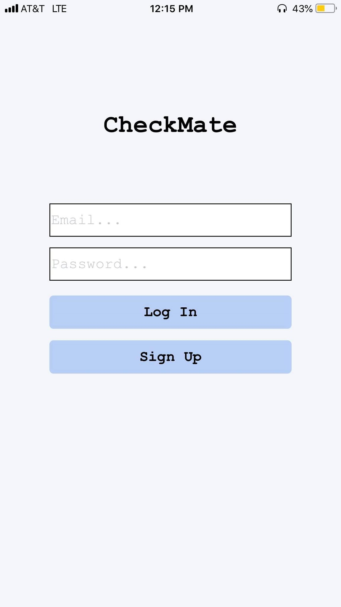
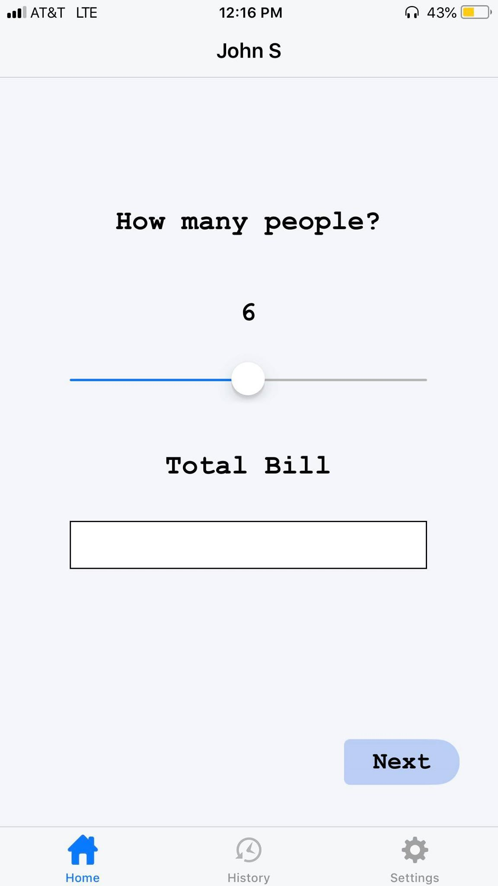
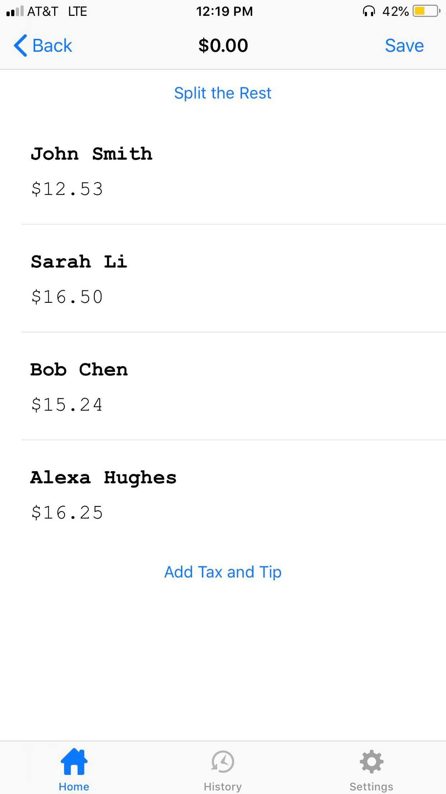
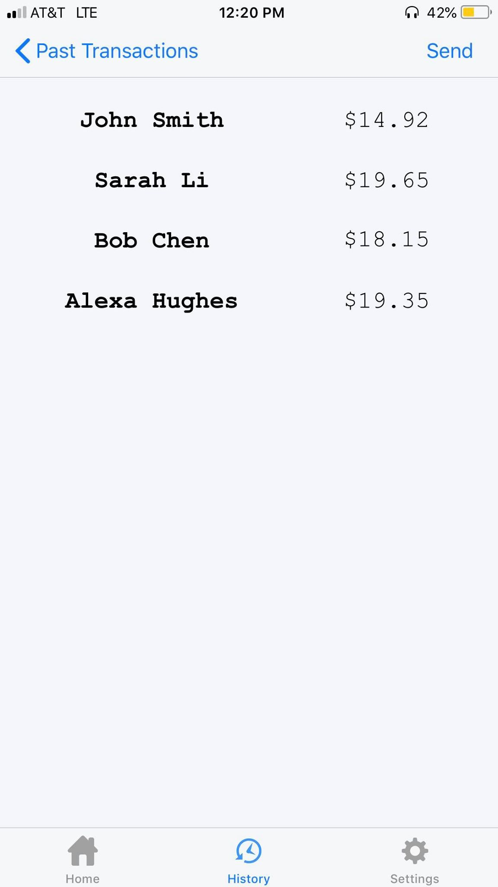

# CheckMate
Checkmate is an iOS application made to help others calculate their food bill without any hassle. It was made intentionally to help college students who often go out to eat with many friends, but the app by all means can be used by anyone. With the simple layout and structure, any user will not have any trouble navigating and operating the application. It contains a login page and keeps track of every transaction you make. You have the choice of deleting them as well as emailing the payments to anyone who wants a copy of the transaction all within the app. Again, this app is designed to give others the most efficient and effective way to calculate each person’s payment so it is important for the application to have a consistent and reliable performance.
- 'CheckMate.xcworkspace' is the file you open to connect to Firebase
- removed node-modules and Pods
- removed my firebase database URL (you can use your own simply by creating a Firebase account)

## Pictures

Login                      | Main Page				   | People                       | History
:-------------------------:|:-------------------------:|:----------------------------:|:---------------------------:
 | |  |